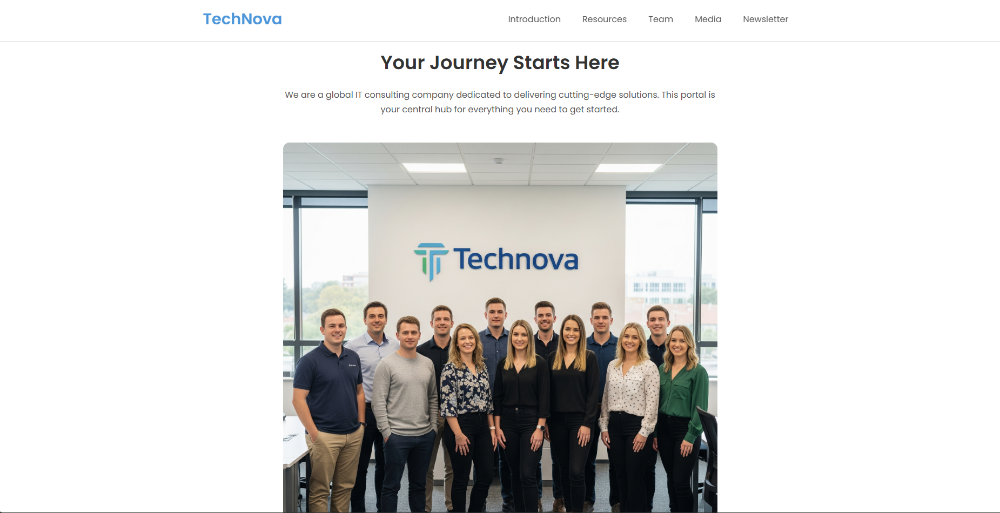
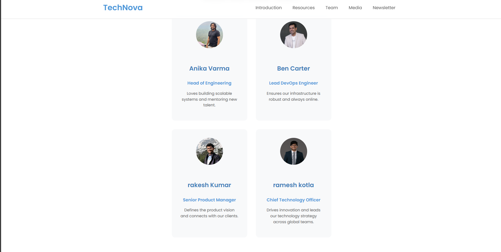
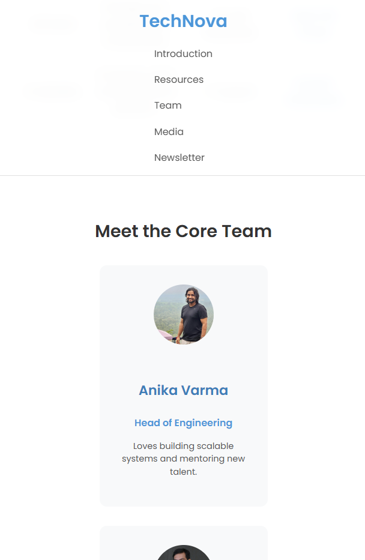
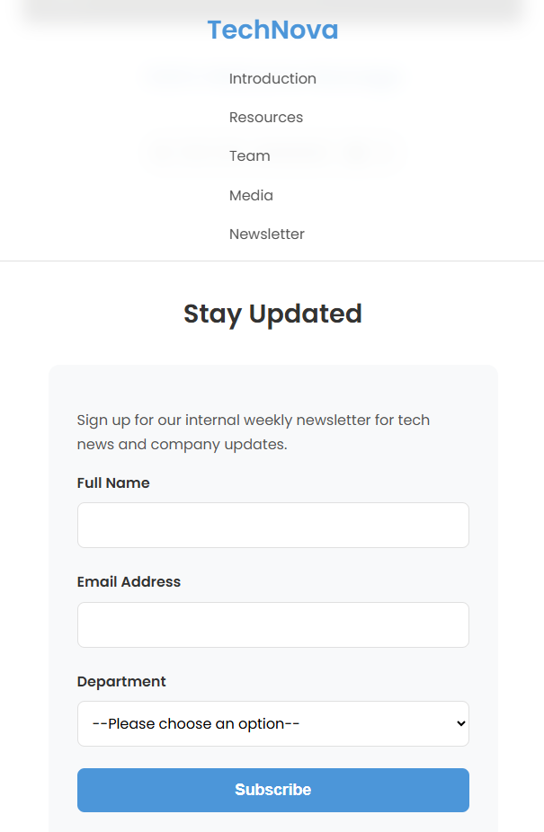

# TechNova Onboarding Portal

A clean, responsive, single-page knowledge portal for new employees, built with pure HTML and CSS.

---

## ✨ Features

- **Fully Responsive:** Adapts seamlessly to desktop, tablet, and mobile screens.
- **Semantic HTML5:** Uses modern tags like `<section>`, `<article>`, and `<nav>` for a well-structured and accessible site.
- **Interactive UI (CSS Only):** Features like active section highlighting (`:target`) and responsive navigation are achieved without JavaScript.
- **Component-Based Sections:** Includes a resource table, team member cards, and a newsletter form.

---


## 🚀 Getting Started

1.  Clone the repository:
    ```sh
    git clone [https://github.com/your-username/technova-portal.git](https://github.com/your-username/technova-portal.git)
    ```
2.  Navigate to the project directory:
    ```sh
    cd technova-portal
    ```
3.  Open the `index.html` file in your web browser.

---
### Screenshot

*(Your screenshot here)*
*(You can add your screenshots here)*




