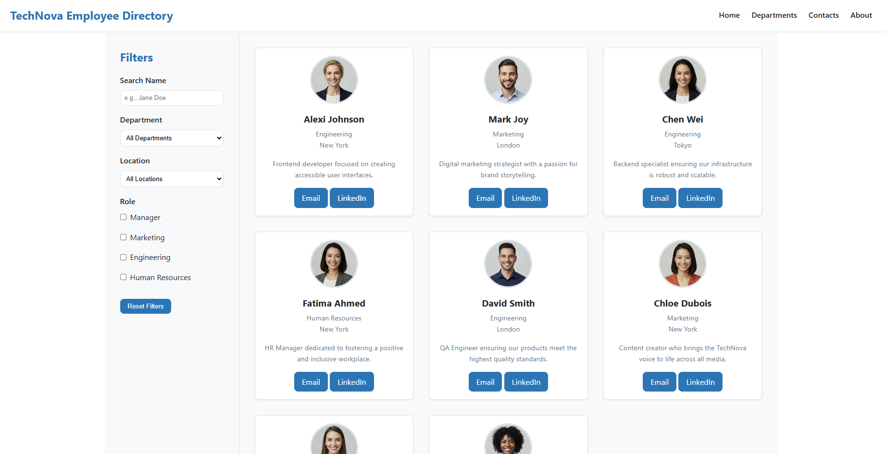
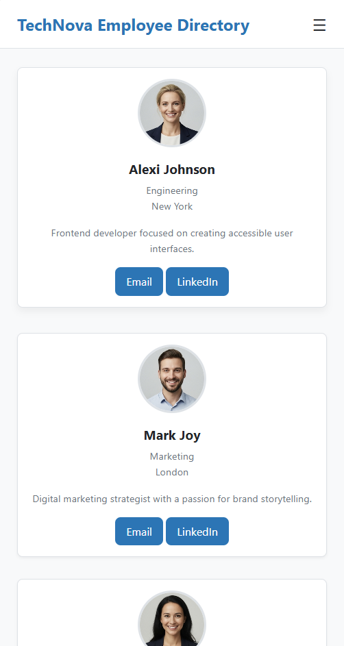
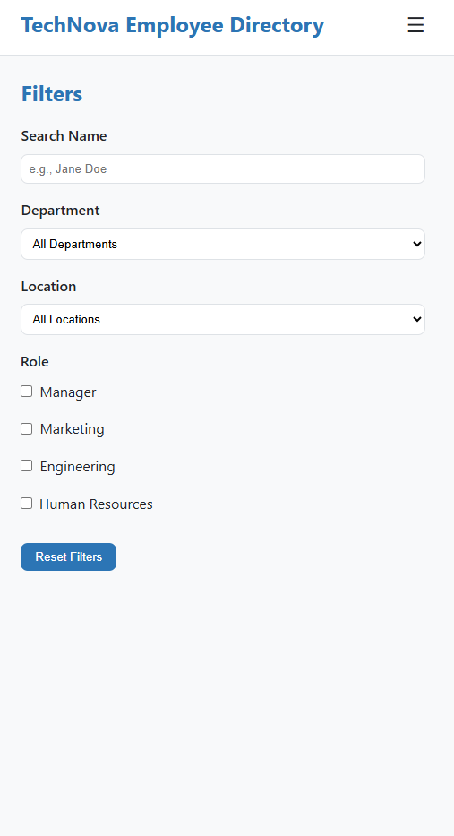

# TechNova Employee Directory

A responsive front-end prototype for an employee directory, built with a focus on pure HTML and CSS, accessibility, and clean design.

---

## Features

-   **Fully Responsive:** The layout seamlessly adapts from mobile to tablet and desktop screens.
-   **CSS-Only Interactivity:** The mobile sidebar toggle is handled without any JavaScript.
-   **Modern Layout:** Uses CSS Grid for a dynamic card layout and Flexbox for component alignment.
-   **Theming:** Utilizes CSS variables for easy customization of colors and spacing.
-   **Accessibility Focused:** Built with semantic HTML, ARIA roles, and accessible forms to ensure it's usable by everyone.

---

## Tech Stack

-   **HTML5**
-   **CSS3** (Flexbox, Grid, Custom Properties/Variables)

---

## How to Use

1.  Clone the repository.
2.  Open the `index.html` file in any web browser.

---

## Project Screenshots

*(You can add your screenshots here)*

