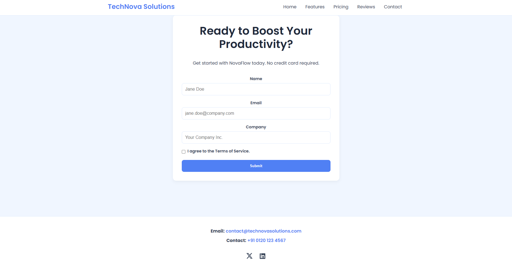

# NovaFlow Landing Page

A responsive and accessible landing page built with **HTML** and **CSS**.

---

## 🏗️ Structure

A minimal setup with content and styling separated.

-   `index.html`: The page structure.
-   `style.css`: All page styles.

---

## ✨ Styling

The design is clean, modern, and easy to maintain.

-   **Mobile-First**: Looks great on any device size.
-   **CSS Variables**: Used for an easy-to-theme color palette and spacing.
-   **Flexbox & Grid**: Used for creating robust, modern layouts.
---

## 🚀 Page Features

The landing page includes several key sections to introduce and market the product.

-   **Hero Section**: A full-width banner with a headline and primary call-to-action.
-   **Features Grid**: A section showcasing the core features of the product.
-   **Pricing Table**: A responsive, 3-tier pricing plan layout.
-   **Testimonials**: A horizontally scrollable section for customer quotes.
-   **CTA Form**: A simple, accessible form for user sign-ups.
-   **Responsive Header & Footer**: Includes navigation, branding, and contact information.

---

## ♿ Accessibility

Built to be accessible to all users.

-   **Semantic HTML**: Clear structure for screen readers.
-   **Keyboard Friendly**: Fully navigable using a keyboard with visible focus styles.
-   **Accessible Labels**: `aria-label` and `alt` attributes provide context.
-   **Skip Link**: A "Skip to main content" link for easier navigation.

---

*(Add your design screenshots or links here.)*

