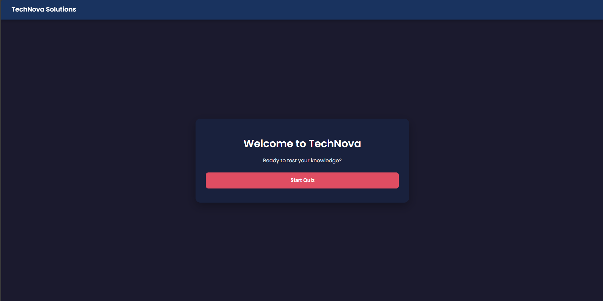
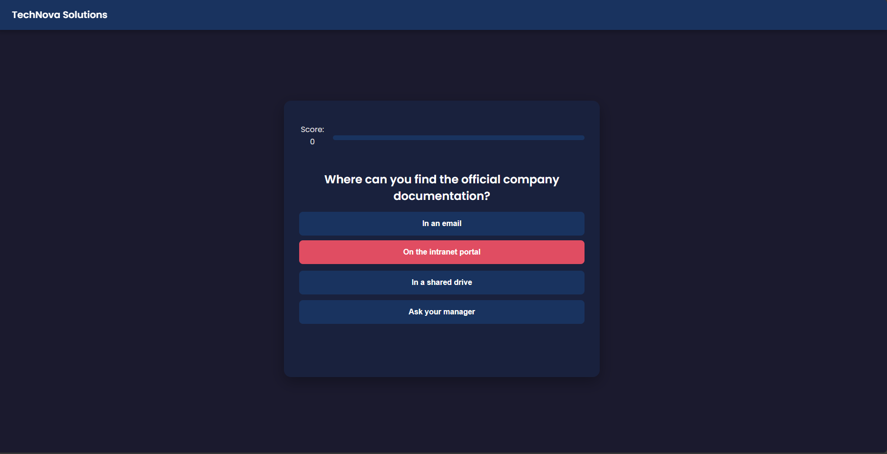
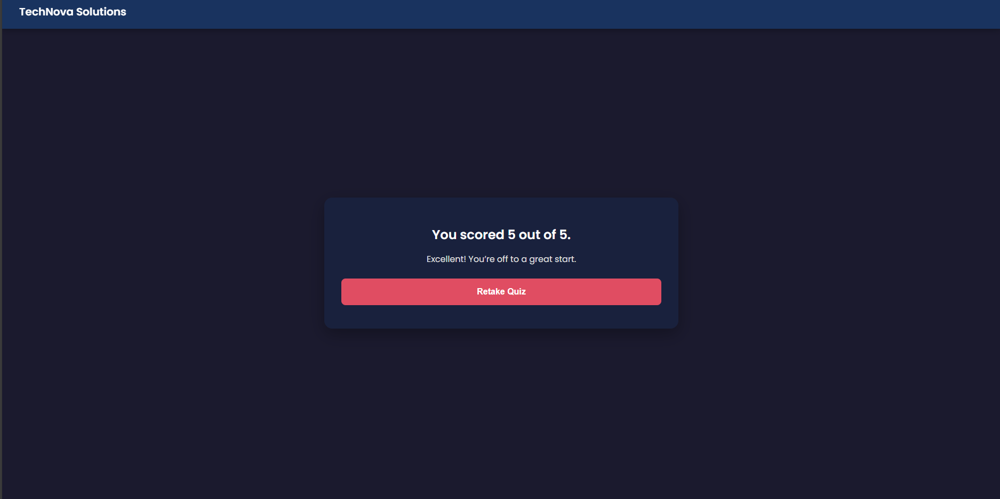

# Interactive Onboarding Quiz

A self-service onboarding quiz tool built with vanilla JavaScript, HTML, and CSS. This project was created as an internal tool for "TechNova Solutions" to help new employees review key company values, benefits, and policies in an engaging and interactive way.

## Key Features

* **Welcome & Result Screens:** Clear start and end points for the user journey.
* **Interactive Quiz Flow:** Questions are displayed one at a time with immediate feedback.
* **Dynamic Content:** Questions and options are rendered dynamically from a JavaScript array.
* **Randomized Questions:** Questions are shuffled at the start of each quiz using the Fisher-Yates algorithm.
* **State Management:** Tracks score and progress throughout the quiz.
* **Audio Feedback:** Provides sound effects for correct and incorrect answers.
* **Responsive Design:** A clean, minimalistic UI that works on various screen sizes.

***

## Core Concepts Implemented

This project demonstrates a solid understanding of core web development technologies:

* **HTML5:** Semantic structure with elements like `<header>`, `<audio>`, and `
` sections.
* **CSS3:**
    * Modern styling with CSS variables for a maintainable theme.
    * Flexbox for layout and alignment.
    * Fixed positioning for the header.
    * Transitions for smooth UI animations.
* **JavaScript (ES6+):**
    * **DOM Manipulation:** `getElementById`, `createElement`, `textContent`, `innerHTML`, `classList`.
    * **Data Structures:** Using an Array of Objects to store quiz data.
    * **Control Flow:** `if/else` statements and `forEach` loops.
    * **Functions:** Modular functions for starting the quiz, showing questions, selecting answers, and handling results.
    * **Asynchronous JavaScript:** Using `setTimeout` for delays and `async/await` with a `try...catch` block to safely handle `audio.play()` promises.
    * **Event Handling:** `addEventListener` for all interactive elements.
    * **Array Methods:** Implementation of the Fisher-Yates shuffle algorithm.

***

## How to Run This Project

Because this project uses JavaScript to load audio files, you cannot run it by opening the `index.html` file directly in the browser due to security restrictions (CORS policy on `file://` protocol).

You must serve the files from a local web server. The easiest way is with the **Live Server** extension in Visual Studio Code.

1.  **Download or Clone:** Get the project files onto your local machine.

2.  **Install Live Server in VS Code:**
    * Open the project folder in VS Code.
    * Go to the **Extensions** view (Ctrl+Shift+X).
    * Search for `Live Server` by Ritwick Dey and click **Install**.

3.  **Run the Project:**
    * Open the `index.html` file.
    * Right-click anywhere in the editor and select **"Open with Live Server"**.
    * This will open the quiz in your default browser using a local server address (e.g., `http://127.0.0.1:5500`), and all features will work correctly.

***

## Screenshots

