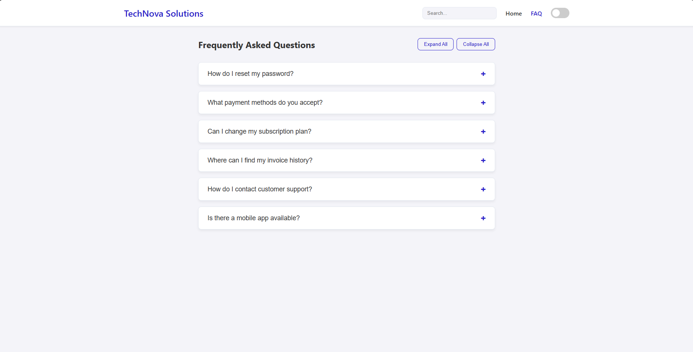
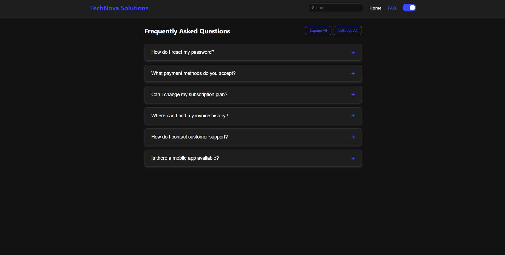

# Dynamic FAQ Accordion

A clean, accessible, and animated FAQ component built with vanilla HTML, CSS, and JavaScript.

---

### ✨ Key Features

-   **Dynamic Content**: FAQs are generated from a simple JavaScript array.
-   **Smooth Animation**: Uses JavaScript-calculated `max-height` for a perfect transition.
-   **Core Functionality**: Includes search, dark mode, and expand/collapse all controls.
-   **Fully Accessible**: Built with ARIA attributes and full keyboard navigation.

---

### ⚙️ How It Works

-   **Data Structure**: All questions and answers are stored in an array of objects in **`script.js`**.

    ```js
    const faqs = [
      { question: "...", answer: "..." }
    ];
    ```

-   **Rendering**: The `renderFAQs()` function dynamically creates and injects the HTML into the page.

---

### 🛠️ Core Techniques

-   **JavaScript**:
    -   **DOM Manipulation** to build the component from the data array.
    -   **Event Handling** for clicks, key presses, search input, and theme changes.
    -   **Dynamic Styling** by calculating `scrollHeight` to power the smooth animations.

-   **Accessibility (a11y)**:
    -   **ARIA Attributes** (`aria-expanded`, `aria-controls`) to communicate state to screen readers.
    -   **Keyboard Navigation** for all interactive elements, including using `Enter` or `Space` to toggle answers.

---

### 🚀 How to Use

1.  **Copy Files**: Add `style.css` and `script.js` to your project.
2.  **Copy HTML**: Copy the `<main class="faq-container">...</main>` block into your HTML page.
3.  **Link Assets**: Link the CSS in your `<head>` and the `defer` script before your closing `</body>`.
4.  **Customize**: Edit the `faqs` array in `script.js` with your own content.

### ScreenShots

