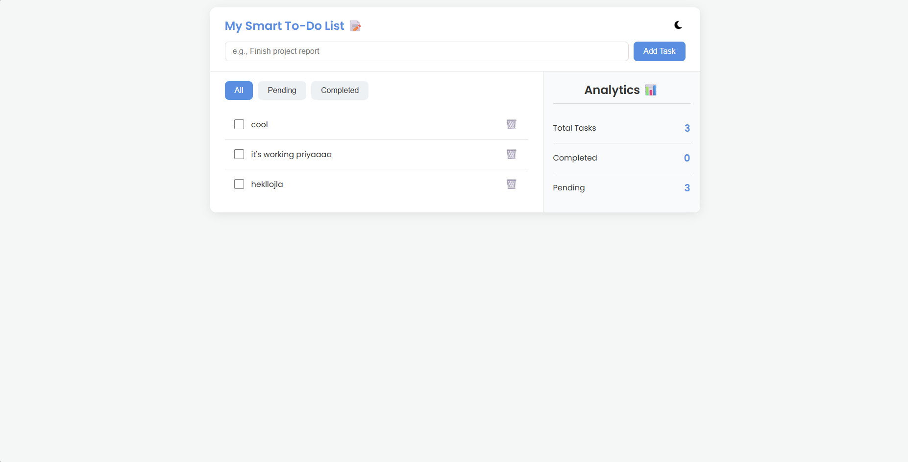
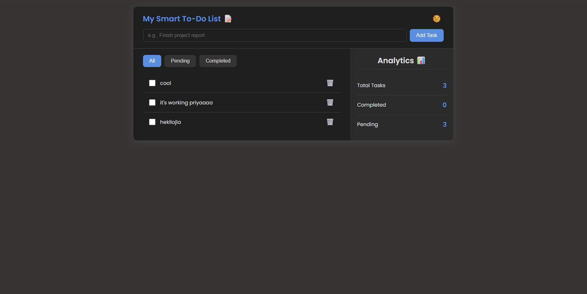

# Smart To-Do List App

A modern and feature-rich to-do list application built with vanilla JavaScript. It helps you manage daily tasks with dynamic filtering, real-time analytics, inline editing, and a theme switcher.

## ✨ Features

-   **Add & Manage Tasks:** Quickly add, delete, and mark tasks as complete.
-   **Inline Editing:** Double-click any task to edit it on the fly.
-   **Dynamic Filtering:** Instantly filter tasks by 'All', 'Pending', or 'Completed' status.
-   **Live Analytics:** A sidebar provides a real-time count of total, completed, and pending tasks.
-   **Persistent Data:** Saves your tasks and theme choice to `localStorage`, so everything is preserved when you return.
-   **Light & Dark Themes:** Switch between light (☀️) and dark (🌙) modes.

## 🚀 How It's Built

This project uses modern, clean JavaScript without any frameworks.

-   **State Management:** A global `tasks` array serves as the single source of truth. All UI updates are rendered based on this array.
-   **DOM Manipulation:** The task list is rendered dynamically. The UI is updated efficiently whenever the state changes.
-   **Event Handling:** Uses **event delegation** for `click` and `dblclick` events on the task list, making it efficient and scalable.
-   **Data Persistence:** The `localStorage` API is used to save the user's tasks and selected theme between sessions. `JSON.stringify()` and `JSON.parse()` are used for storing and retrieving the tasks array.
-   **Theming:** A `dark-theme` class is toggled on the `<body>` element, and CSS variables handle the color changes for a smooth theme transition.

## 📸 Screenshots

*(You can add your own screenshots here)*

**Light Theme - Desktop View**

**Dark Theme - Mobile View**
